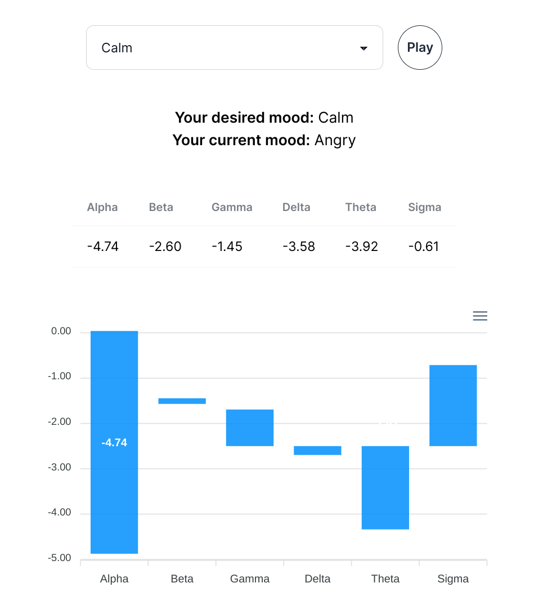

# fhgr-cds-310-neuroscience
Repository for hackathon in neuroscience module cds-310@FHGR

## Project members
- André Glatzl
- Benito Rusconi
- Dennis Bilang
- Flavio Dunlop

## Goal of the project
The goal of our project is to set a target mood according to the brain wave frequencies.
- Gamma (greater than 30Hz)
- BETA (13-30Hz)
- ALPHA (8-12 Hz)
- THETA (4-8 Hz)
- DELTA (less than 4 Hz)

We try to pick a playlist or a song according to the given mood and stimulate the brain to achieve the change of mood, e.g. we want to put our users to a more calm environment for studying.

## Python Environemnt
- ``conda create --name myenv python=3.10``
- ``conda activate myenv``
- ``conda install pip``
- ``pip install -r requirements.txt``

# Spotify Credentials

At the moment, the credentials are hard-coded. However, to modularise it, the credentials need to be migrated to an environment variable file and imported from there.

To use the Spotipy SDK, you need to create a Spotify App and invite the Spotify user to the app.

The following credentials are needed:

 - username
 - client_id
 - client_secret

## Project structure
- [Data Simulator](./random_data_generator.py)
    - Here we created a data simulator for testing our code as it is hard to achieve a consistent brain wave change
- [Preprocessing](./preprocessing.py)
    - Here we implemented our preprocessing logic
- [GUI](./frontend/abdf-frontend)
    - We added a little frontend for easier target value selection (WIP)
- [Start Code](./)
    - To run the code use the following:
        - ``python .\datastream.py``
    - Then start the frontend:
        - ``cd .\frontend\abdf-frontend``
        - ``yarn install``
        - ``yarn run dev``
